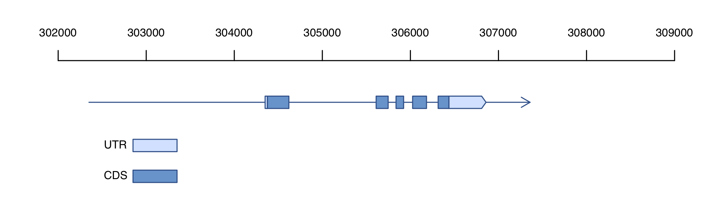
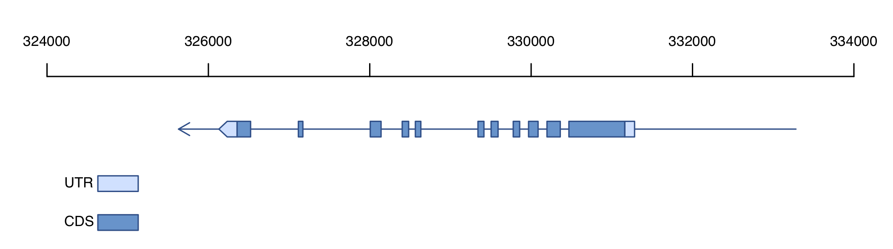

# GFF2Gene_structure.pl


## Description
__`GFF2Gene_structure.pl`__ can be used to draw the Gene structure quickly in `PDF` format based on the GFF and gene's ID. It will become a useful tool for `drawing gene structure` with the advantages of a simple input data format, easily modified output and very good portability. __`GFF2Gene_structure.pl`__ is open source, so all we ask is that you cite our most recent paper in any publications that use this script:</br>
> 基因结构作图.</br>
> A tool to draw Gene structure based on perl and R language.</br>

## Dependencies
All __`R`__ versions and __`perl 5`__</br></br>

## Getting started
Put __`Genes_on_Chr.R`__ and GFF files in a same dir, then run:</br>
```
     perl  GFF2Gene_structure.pl  genome.gff  Your_gene_ID
e.g. perl  GFF2Gene_structure.pl  test.gff  Si1g001080.2
e.g. perl  GFF2Gene_structure.pl  test.gff  Si1g001100.1
```
</br>

## Contact information
For any questions please contact xukai_li@qq.com</br>
